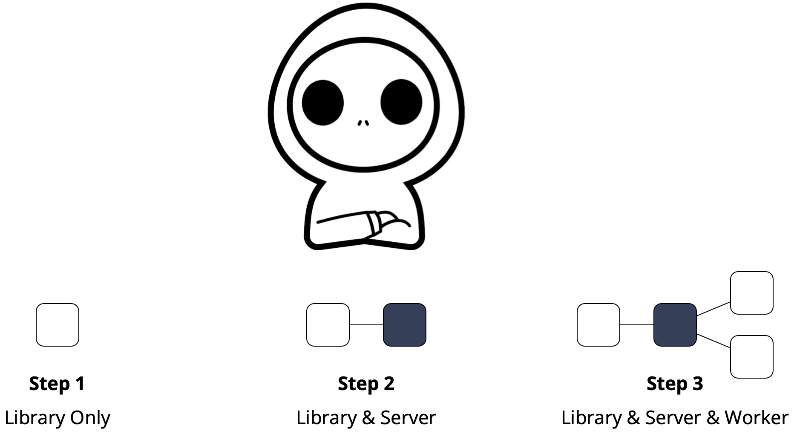

# Quickstart • TypeScript SDK for Resonate

<p align="center">
    
</p>

This quickstart will introduce the Resonate TypeScript SDK step-by-step

## The Sample Application

The sample is an Express web app using the Resonate SDK to simulate the process of web content summarization:

```bash
# Summarize a URL
$ curl -X POST http://localhost:3000/summarize -H "Content-Type: application/json" -d '{"url": "http://example.com"}'
```

The function `downloadAndSummarize` consists of two steps and calls `download` and `summarize`. Both download and summarize return a hard coded value but introduce deliberate delays and errors to mimic real-world behavior:

```typescript
// Simulates downloading and summarizing web content.
export async function downloadAndSummarize(ctx: Context, url: string) {
    // Simulate downloading content.
    let content = await ctx.run(download, url);
    // Simulate summarizing the downloaded content.
    let summary = await ctx.run(summarize, content);
    // return summary
    return summary;
}
```

## Step 1 🏴‍☠️ 

In [Step 1](./Step1/Readme.md), develop your first Distributed Async Await application with the Resonate SDK, enjoying transparent retries, rate limits, tracing, and metrics.

## Step 2 🏴‍☠️ 

In [Step 2](./Step2/Readme.md), boost your application's **reliability** by integrating with a Resonate Server, enabling recovery to mitigate failures.

## Step 3 🏴‍☠️ 

In [Step 3](./Step3/Readme.md), boost your application's **scalability** by deploying Resonate Workers, enabling fan out and fan in to mitigate demand.
